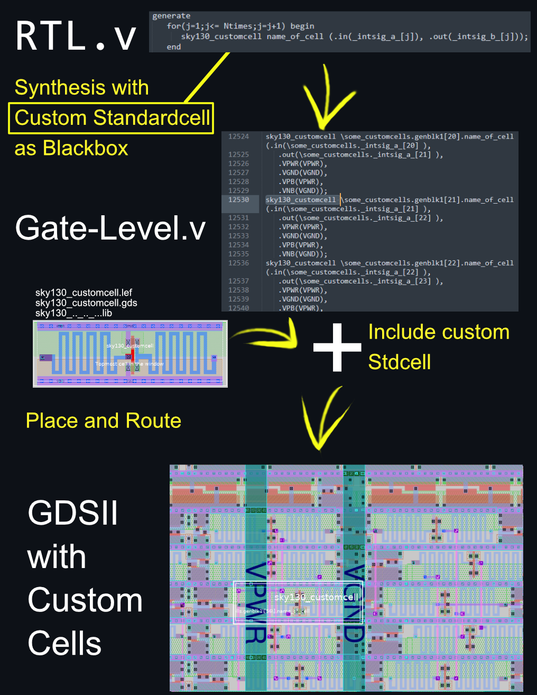
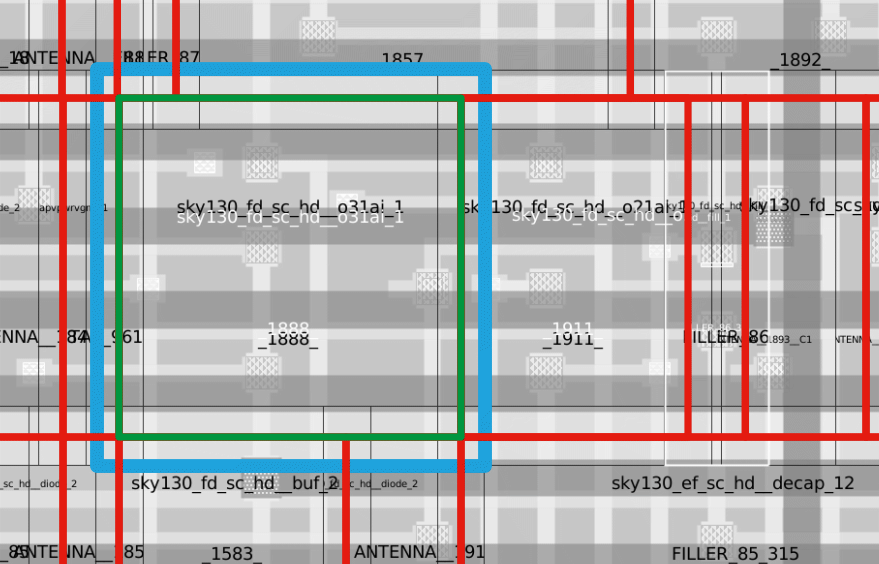
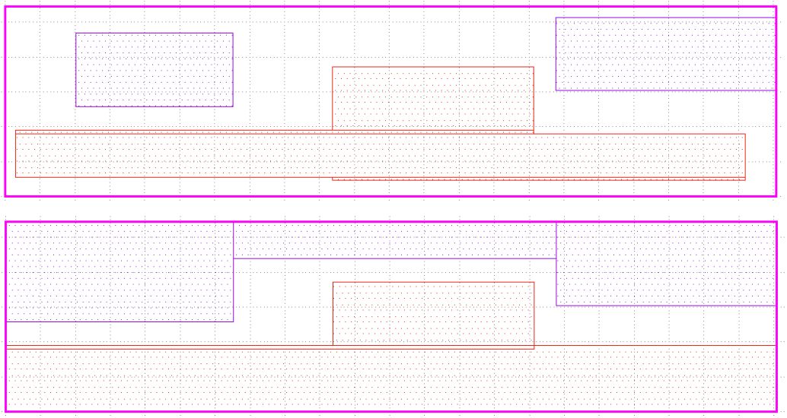
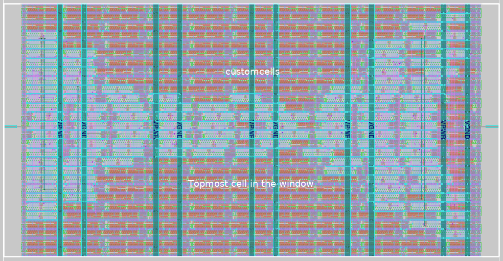

# SKY130 Workflow RTL-with-Custom-Standardcell to GDSII-Macrocell

**Initial version by Manuel Moser,
update by Harald Pretl.**

If you want RTL mixed with predefined standard cells (including custom cells), synthesized, and converted to a GDSII macro while the workflow is not allowed to "optimize" the structure, then this guide is for you.

This documentation was written using the SKY130 [iic-osic-tools](https://github.com/iic-jku/iic-osic-tools) design environment and is sponsored by lots of coffee.



## Design of a custom standard cell using `magic`

Making custom standard cells is pretty difficult. You have to make sure that your standard cells boundary box abuts all other standard cells in all orientations without generating DRC errors [4]. Keep an eye on your log files, especially the DRC and manufacturability logs, and double-check your results. 

In the end, the standard cell should look somewhat like this:


### Cell layout

Read this first: [Design rules](https://github.com/nickson-jose/vsdstdcelldesign)  

### Port alignment

For place & route, all ports should be aligned on the intersections [2] of a grid. To show the grid for high-density cells (`sky130_fd_sc_hd__...`) type `grid 0.46um 0.34um 0.23um 0.17um` into the magic TCL-console. Maybe adapt the grid if you work with a different library than **`_hd_`**. 

Grid-based routers work best when all pins of all standard cells are sitting directly on top of a route grid intersection, and a via can be placed cleanly on the point without having to be shifted to avoid causing a DRC error with some other nearby net.  So "on-grid pins" mean all pins are nicely centered on grid intersections. [3]

### Cell size
The standard cells must abut each other in all directions and orientations without creating DRC errors when the standard cells are placed in the standard cell grid. The following image should clarify the difference between the abutment box and the outline of the standard cell. Blue is the outline of a cell `031ai_1` and is allowed to overlap other cells, green is the related abutment box. The red boxes are the abutment boxes of neighboring standard cells. Property `FIXED_BBOX` defines the outline of the abutment box. 



X and Y dimensions of the abutment box must align to values X-Grid and Y-Grid - [see PDK Documentation](https://antmicro-skywater-pdk-docs.readthedocs.io/en/latest/contents/libraries/foundry-provided.html). For a high-density `_hd_` custom cell, the abutment box size is $(N \cdot 0.46 \mu m) \times (8 \cdot 0.34 \mu m)$. Scale the result to your Magic internal value (lambda). In our case, a multiplication by 200 is needed since the internal lambda-grid is 0.005um, so for a total abutment box size of $h = 2.72\,\mu m$ and $w = 9.66\,\mu m$ the proper configuration for our custom cell would be `property FIXED_BBOX {0 0 1932 544}`.

The PDK high-density standard cell layouts are located in `$PDKPATH/libs.ref/sky130_fd_sc_hd/mag/` if you want to see reference designs.

### Tap connections
Most standard cells don't have tap (n-/p-well) connections in the cell layout (which is the case in a tap-less standard cell library); instead, there are ports `VNB` on `pwell` and `VPB` on `nwell` defined. The tap connections are inserted by a dedicated [tap standard cell](https://antmicro-skywater-pdk-docs.readthedocs.io/en/test-submodules-in-rtd/contents/libraries/sky130_fd_sc_hd/cells/tapvpwrvgnd/README.html).

### Placement of poly connectors
It is good practice to place poly-connectors only in the middle area of the standard cell [5].

### Standard Cell MOSFETs
Standard cells allow smaller MOSFETs than analog designs. To notice DRC checkers that the cell is a standard cell, there are dedicated MOSFET layers in `magic`. When exporting the `.gds` of the cell `magic` will know by these layers that the cell is a standard cell and places the (araid.sc) layer over the `FIXED_BBOX` area.

The dedicated layers are hidden. Unlock the layers by typing `tech unlock *` and then replace the nominal MOSFET layers with the standard cell MOSFET layers. Layer `nmos` is replaced with `scnmos`, `pmoshvt` with `scpmoshvt`, and so on. Note that the high-density library `_hd_` is using high $V_\mathrm{threshold}$ P-channel MOSFETs and nominal N-channel MOSFETs, I found it is easier to meet DRC rules if the technology in the custom standard cell is the same.

### Port definition

Select the area where you want a port connection, then select `Edit` and `Text..` in Magic. Enter the name of the port in `Text`-string, uncheck `default`, enter the layer where the port should be (`li1`, `metal1`, etc.), if needed set the size to i.e. 0.1um, check `Port enable`, and choose connection orientations (`n`, `s`, `e`, `w`, `center`, ...).

The router needs to know some additional properties of your ports. Set the following properties in the Magic tcl-console for each port:

`VPWR` and `VPB` (PMOS bias):

```tcl
port use power
port class inout
port shape abutment
```

`VGND` and `VNB` (PMOS bias):

```tcl
port use ground
port class inout
port shape abutment
```

Input signals:

```tcl
port use signal
port class input
```

Output signals:

```tcl
port use signal
port class output
```

### LEF file options

Enter in the Magic TCL-console:

```tcl
property LEFclass CORE
property LEFsource USER
property LEFsite unithd
property LEForigin {0 0}
```

### Generate LEF and GDS file

Type in the Magic TCL-console:

```tcl
lef write
gds
```

Ensure that the PSDM and NSDM layers will not throw DRC errors by extending these layers using `klayout` to the edges of the abutment box. See the following image, top is a generated standard cell `gds` using `magic`, bottom is the post-processed standard cell with extended layers `psdm.drawing` (purple) and `nsdm.drawing` (red). Do the same with `hvtp.drawing` if used.  



### Generate LIB file
You can try to look into the `OpenROAD` command `write_timing_model` to generate a `.lib` file for the custom standard cell, but this feature might be experimental.  

Alternatively, it is possible to use a dummy lib if a design that is using the custom standard cell is verified by analog post-layout simulation. Use the `tt` library file from `$PDKPATH/libs.ref/sky130_fd_sc_<TYPE>/lib/` as a template for custom lib-files. The resulting file should contain the header and a definition for the custom standard-cells `cell ("name_of_your_cell") { ... }`. 

Note: The timing and power tables do not contain correct data in this example. Instead, we have copied the data from a different cell with an identical logical function and ditched updating the copied tables. The flow will still run through since we did not allow altering/optimizing the functional structure after synth in the `config.tcl` file. 

## OpenLane: RTL-to-GDSII config and workflow
Openlane synthesizes the RTL file with the custom cells treated as a black box. The synthesized file is then parsed for floorplan generation, placement, and routing.

### Config file

In the OpenLane config-file `../openlane/<CELL-NAME>/config.tcl`, add the following lines:

```tcl
# Include Custom Standardcells  
 set ::env(EXTRA_LEFS) [glob $::env(DESIGN_DIR)/src/*.lef]  
 set ::env(EXTRA_LIBS) [glob $::env(DESIGN_DIR)/src/*.lib]  
 set ::env(EXTRA_GDS_FILES) [glob $::env(DESIGN_DIR)/src/*.gds]  
 set ::env(SYNTH_READ_BLACKBOX_LIB) 1  
```

### Run OpenLane

Run `flow.tcl -design <DESIGN_NAME>` in `/foss/designs/<PROJECT-NAME>/openlane/`


Results are located in `../openlane/<CELL-NAME>/runs/results`.



### Interactive mode

This step is not necessary, but useful for troubleshooting! Further documentation can be found in [Openlane Interactive Mode Documentation](https://openlane-docs.readthedocs.io/en/rtd-develop/doc/advanced_readme.html).

Open a console in `/foss/designs/<PROJECT-NAME>/openlane/` and run the following command; the output folder will be prepared with the current config in `../openlane/<CELL-NAME>/runs/foobar`.

```shell
flow.tcl -interactive -design customcells -tag foobar -overwrite
```

When in interactive mode, step through the flow with the following commands:

```tcl
package require openlane
run_synthesis
run_floorplan
run_placement
run_cts
run_routing
write_powered_verilog -output_def $::env(TMP_DIR)/routing/$::env(DESIGN_NAME).powered.def -output_verilog $::env(TMP_DIR)/routing/$::env(DESIGN_NAME).powered.v 
run_magic
run_magic_spice_export
run_magic_drc
run_lvs
run_antenna_check
```

### Note

The following commands are often suggested in old VLSI workshop repositories, but in our design environment they will generate a second and identical custom-cell entry in the `merged.unpadded.lef` file at the step "detailed routing." The flow will then crash with the error `No valid access pattern`. Just include the LEF files in `config.tcl`:

```tcl
set lefs [glob $::env(DESIGN_DIR)/src/*.lef]
add_lefs -src $lefs
```

### Citations
[1] https://github.com/nickson-jose/vsdstdcelldesign  
[2] https://github.com/AngeloJacobo/OpenLANE-Sky130-Physical-Design-Workshop  
[3] https://open-source-silicon.slack.com/archives/C0169AJSEUE/p1594165643007800  
[4] https://open-source-silicon.slack.com/archives/C016H8WJMBR/p1662924070593949?thread_ts=1662913624.739489&cid=C016H8WJMBR  
[5] https://open-source-silicon.slack.com/archives/C016H8WJMBR/p1662904893242129?thread_ts=1662662701.454629&cid=C016H8WJMBR